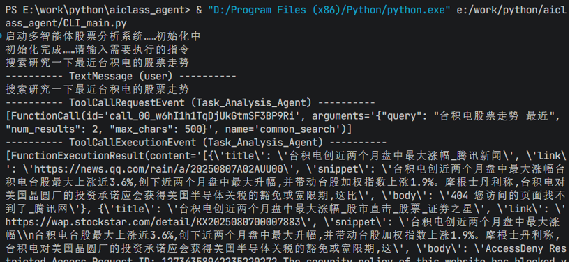
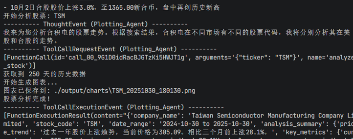
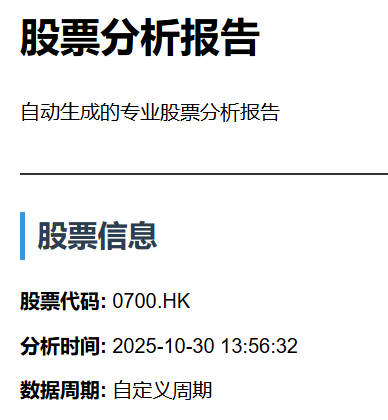
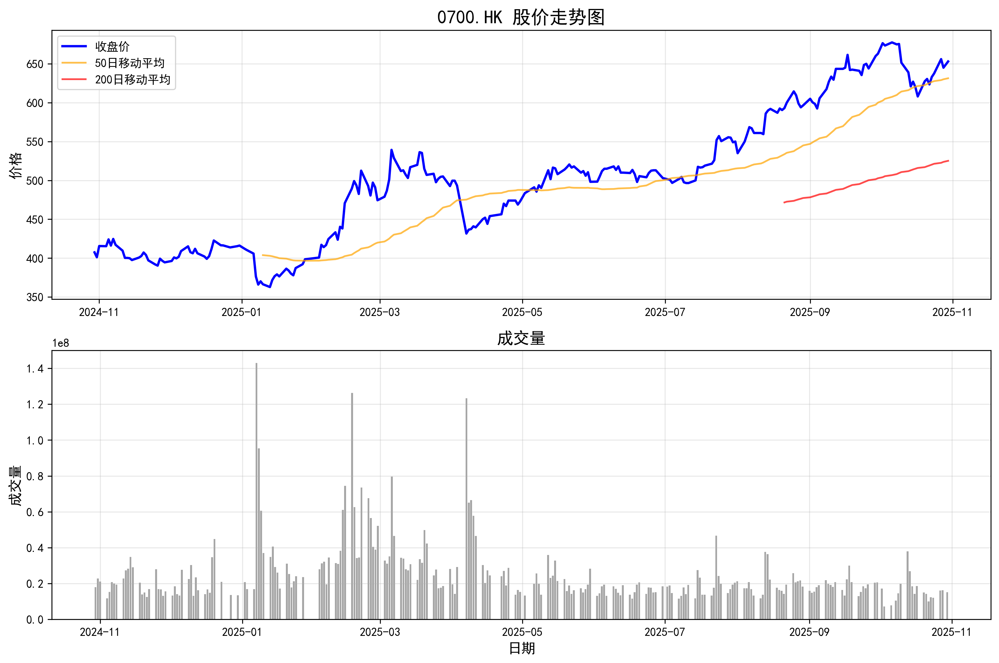
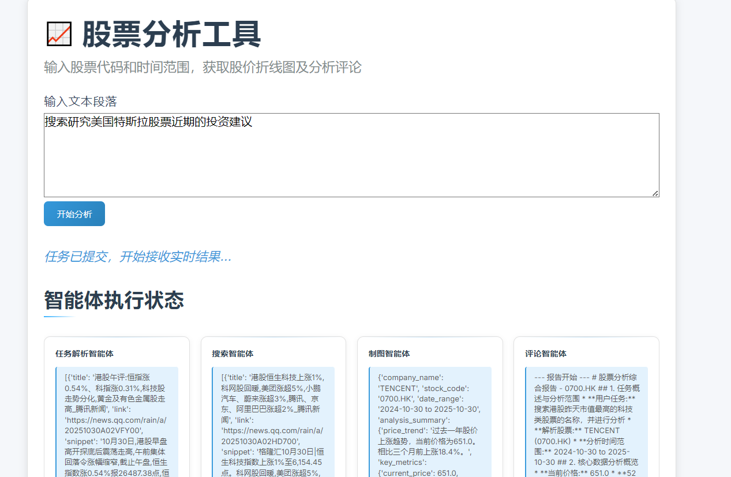

# 人工智能课程第八组-Agent

## 项目简介
开发多智能体，输入指令后搜索指定的股票价格，作折线图，并对搜索到的结果发表评论，最后把所有内容进行整合输出。

*参考文档：https://microsoft.github.io/autogen/stable/user-guide/agentchat-user-guide/examples/company-research.html*

结构：round-robin-team

大模型和搜索工具使用的apikey在`.env`文件（已加入`.gitignore`，未上传）中统一管理。
## 使用方法（2025.10.30update）

CLI启动：直接运行`CLI_main.py`，参照测试用例（e.g.：搜索港股昨天市值最高的科技类股票的名称，并进行分析）的语句输入指令开始运行。

前端启动：运行`api_server.py`，然后访问`http://127.0.0.1:5000/`，在输入框中输入指令，点击“开始分析”开始运行。~~更推荐使用CLI界面~~

测试指令文件：`测试_指令.md`

*注意事项：`yfinance`库需要使用魔法上网访问，且对A股数据支持差，搜索时建议聚焦港股美股进行分析。本工具在`.env`文件中设置的默认联网端口为7890，请参照本机魔法上网工具配置进行调整，否则可能发生大模型API连接超时的故障。*

## 运行结果展示
### CLI界面

### 输出结果

### 前端界面

## 基本环境配置
*参考文档：https://microsoft.github.io/autogen/stable/index.html*

虚拟环境基准：python 3.12

需求库：（pip install安装） 

`autogen-agentchat`

`autogen-ext`

`yfinance`

`matplotlib`

`pytz`

`numpy`

`pandas`

`python-dotenv`

`requests`

`bs4`

`flask`

## 开发任务分工
CLI主程序Main.py编写，其他代码内容整合——薛睿

前端设计——韩奇言

前后端通信——段薇

智能体策略编写——连一超（任务解析）、苏弘康（数据检索）、郭文楷（数据分析）、朱经政（数据评论）、张天明（数据输出）

测试脚本（5组）编写和测试运行——赵崎含

测试运行并录制demo视频、整合PPT、word、展示——温建平
